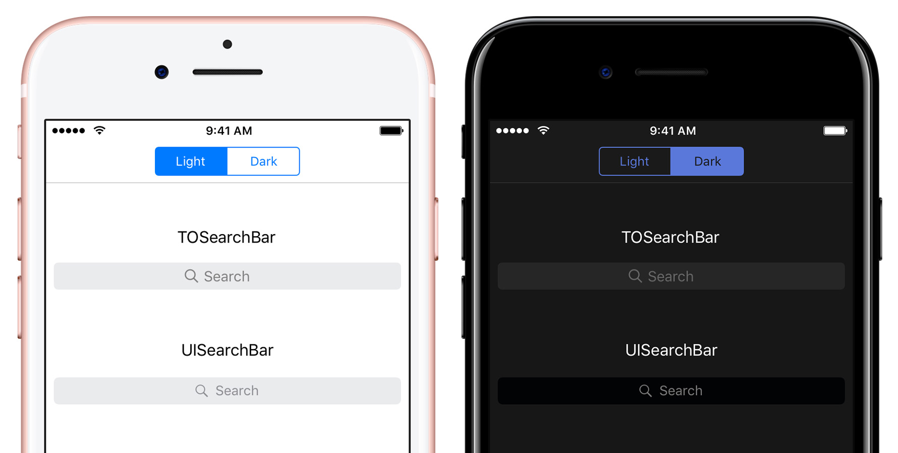

[](http://api.travis-ci.org/TimOliver/TOSearchBar.svg)
[](https://cocoapods.org/pods/TOSearchBar)
[](http://cocoadocs.org/docsets/TOSearchBar)
[](https://raw.githubusercontent.com/TimOliver/TOSearchBar/master/LICENSE)
[](http://cocoadocs.org/docsets/TOSearchBar)
[](https://beerpay.io/TimOliver/TOSearchBar)
[](https://www.paypal.com/cgi-bin/webscr?cmd=_s-xclick&hosted_button_id=M4RKULAVKV7K8)

# TOSearchBar

`TOSearchBar` is a basic re-implementation of [`UISearchBar`](https://developer.apple.com/reference/uikit/uisearchbar), Apple's UI control for performing simple text-based searches. Unlike `UISearchBar`, `TOSearchBar` has been designed to be much more easily themed, as well as provide smoother, more native feeling animations.

# Features

* A very simple and intuitive API.
* iOS 7 style spring animations when entering and leaving focus.
* Uses `IBDesignable` to be fully visible/configurable in Interface Builder.
* Provides default themes for both light and dark modes.
* Every internal UI element is exposed for custom theming.
* An extensive delegate object for dynamically controlling its behavior.
* Dynamic images generated at runtime, and recycled amongst all instances.

# Installation

`TOSearchBar` will work with iOS 7 and above. While written in Objective-C, it should easily import into Swift as well.

## Manual Installation

Copy the contents of the `TOSearchBar` folder to your app project.

## CocoaPods

```
pod 'TOSearchBar'
```

## Carthage

Feel free to file a PR. :)

# Why build this?

I'm building a [comic reader app](http://icomics.co) that uses a dark theme for a lot of its UI. While I tried very hard to make it work, I ultimately became very frustrated by `UISearchBar`'s lack of customizability. It's not possible to change the color of its elements without a lot of hacking, and some of its animations are downright broken. A [colleague reasoned that it's the most broken UI control in iOS](https://twitter.com/icanzilb/status/785411489712726016) and I'm pretty sure he's right!

As a result, I decided to build this control. It's not as fully featured as `UISearchBar`, but I'm sure we can add additional functionality to it as needed. :)

# Credits

`TOSearchBar` was created by [Tim Oliver](http://twitter.com/TimOliverAU) as a component of [iComics](http://icomics.co).

iPhone 7 Plus device mockup by [Pixeden](http://www.pixeden.com).

# License

`TOSearchBar` is available under the MIT license. Please see the [LICENSE](LICENSE) file for more information. 
